# 🎬 Book It Now – Movie Experience Optimization & Engagement Platform

**Book It Now** is a mobile application designed to provide users with a seamless, intuitive, and engaging experience for booking movie tickets. Unlike traditional ticketing applications, Book It Now emphasizes seat visualization, verified user reviews, and reward-driven engagement. This combination makes the movie-going experience more informed, reliable, and community-focused.

---

## 1️⃣ Introduction

In the modern movie-ticketing ecosystem, most applications allow users to browse films, select showtimes, choose seats, and complete payments. However, these platforms have significant limitations. Users often rely on external review platforms, such as IMDb or Google Reviews, which may contain biased or unverified opinions. Additionally, the seat selection process in most apps does not accurately represent viewing angles or overall comfort, leading to user dissatisfaction. Once the ticket is purchased, there are typically no mechanisms for post-purchase engagement or loyalty rewards, causing user interaction to end abruptly.

Book It Now addresses these challenges by combining ticket booking, immersive seat previews, verified reviews, and a reward-based credit system. Users can explore currently showing and upcoming films, select their city and preferred cinema hall, choose convenient showtimes, and complete their bookings through an intuitive interface. The platform ensures that post-movie engagement is encouraged and that users are rewarded for contributing genuine feedback.

---

## 2️⃣ Key Features

| Feature | Description |
|---------|-------------|
| **Seamless Movie Booking** | Users can browse currently showing and upcoming films, select their city, theatre, and showtime, and book tickets through a simple and intuitive interface. The process is designed to be fast, efficient, and user-friendly, reducing the complexity of planning a movie visit. |
| **Seat Preview Option** | The application provides a real-time 2D seat preview, allowing users to visualize the movie screen from their selected seat. This helps users understand viewing angles, screen visibility, and overall comfort before confirming a booking. Future enhancements include a 360-degree immersive seat-view feature. |
| **Verified Review System** | Only users who have booked and attended a movie are allowed to submit reviews. The review process is structured using a set of 10 short questions, ensuring that feedback is detailed, meaningful, and authentic. This eliminates fake or biased reviews and provides other users with reliable insights. |
| **Reward System** | Users earn credits for submitting verified reviews and achieving milestones, such as reviewing multiple movies. Accumulated credits can be redeemed as dummy wallet money. This system motivates users to actively engage with the platform and contributes to a community-driven ecosystem. |
| **Community-Led Movie Discovery** | The app allows users to explore movies based on verified audience feedback rather than generic ratings. Users can make informed choices guided by genuine experiences, fostering a trustworthy and interactive community of moviegoers. |
| **Clean and Modern UI** | The application has a visually appealing interface with intuitive navigation, readable typography, and consistent colors. Smooth animations and interactive elements make the overall experience enjoyable, reducing confusion and increasing satisfaction for first-time and returning users. |
| **Post-Movie Engagement** | Users are encouraged to submit reviews only after the movie showtime has passed. This post-movie engagement ensures the authenticity of feedback while simultaneously promoting user retention and long-term interaction with the platform. |

---

## 3️⃣ Tech Stack Used

Book It Now was developed using a combination of modern technologies that ensure high performance, scalability, and maintainability. 

**Frontend:**
- **Flutter** – a cross-platform framework allowing a single Dart codebase to run on both Android and iOS. Flutter provides smooth animations, pixel-perfect UI control, and rapid development using hot reload.|

**Backend:** 
 - **Firebase** – a serverless backend platform providing secure authentication, real-time database management with Cloud Firestore, serverless business logic with Cloud Functions, and media storage via Cloud Storage.

**APIs:**
- **TMDb API:** Provides movie metadata, posters, trailers, and cast information.
- **Overpass API:** Supplies geolocation data to recommend nearby cinemas across multiple cities.

This combination of technologies ensures that the application delivers a **smooth, real-time, secure, and interactive experience** for all users, while allowing for future scalability and feature expansion.

---

## 📸 Glimpses of Book It Now

### 1. Splash Screen
The splash screen provides a visually appealing introduction to the Book It Now application, displaying the app logo and branding.

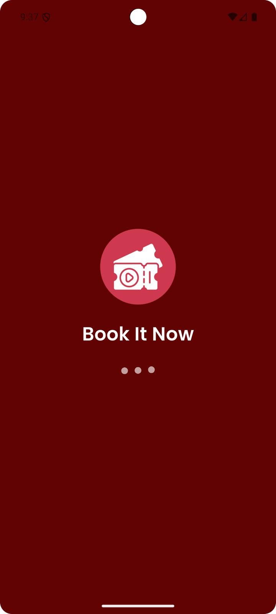

### 2. Sign-Up & Sign-In Screens
The sign-up screen allows new users to create an account quickly and securely by providing their basic information, enabling them to access the app’s features immediately after registration.

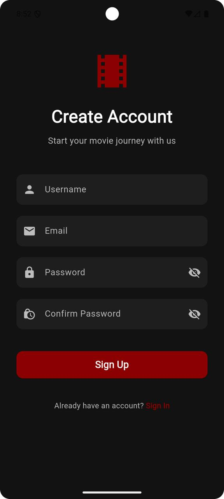

Returning users can log in through the sign-in screen using their registered credentials, ensuring a smooth and secure entry into the app.

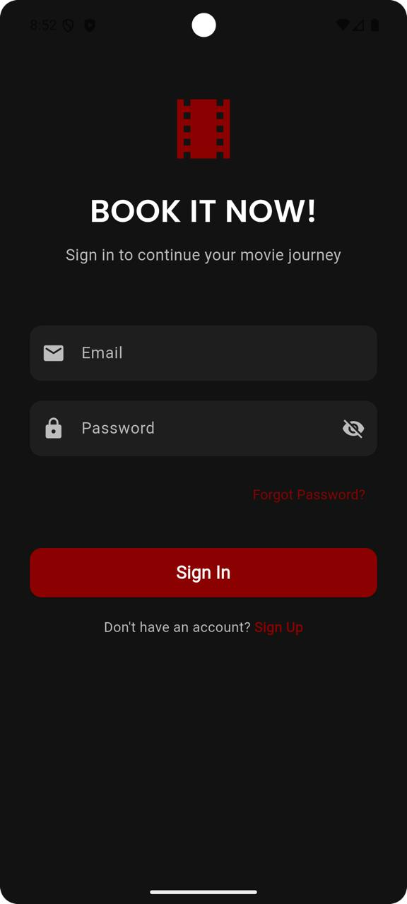

### 3. Home Page
After logging in, the home page provides a central hub for exploring movies, accessing upcoming bookings, and navigating through the app with an intuitive interface. Users can also browse movies according to Genres. 

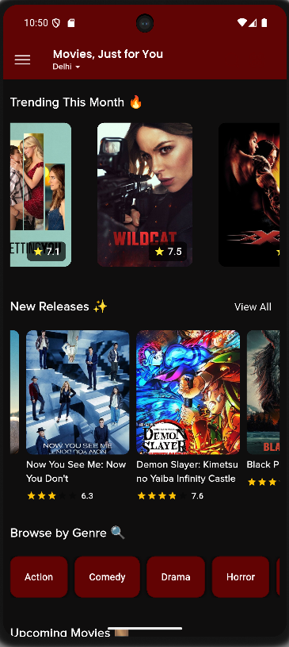

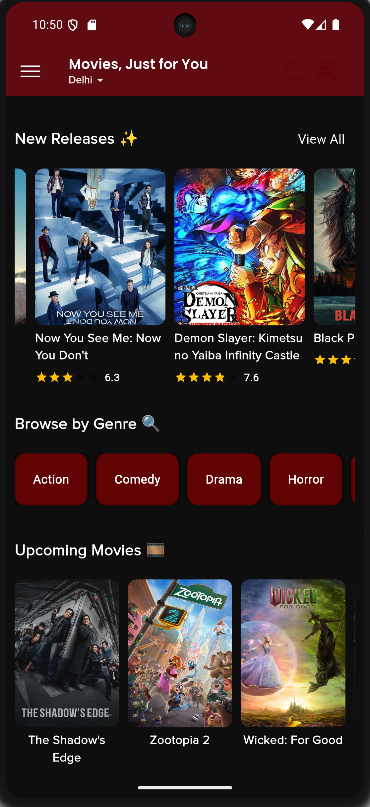

### 4. Side Drawer
The side drawer serves as a convenient navigation panel that displays the user’s wallet balance, total earned credits, upcoming bookings, and a logout option. It allows users to quickly access essential information and manage their account without leaving the home screen. 

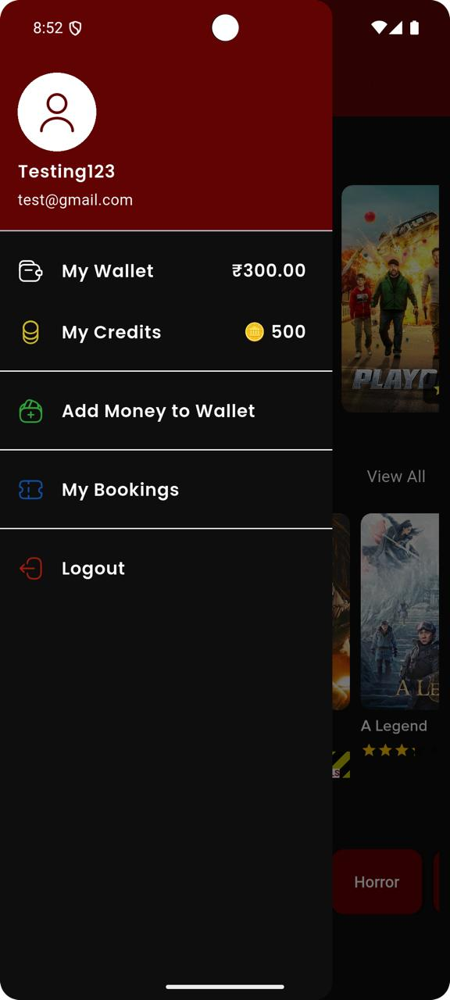

### 5. Movie Details Screen
This screen presents detailed information about each movie, including its synopsis, cast and crew details, trailers, and verified user reviews. Users can evaluate all aspects of a movie before proceeding to select showtimes and book tickets, making informed decisions based on authentic feedback.

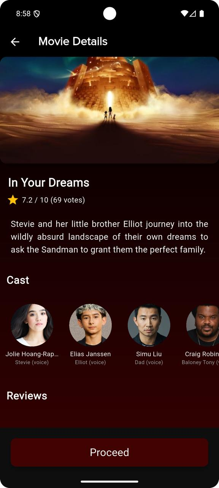

### 6. Location Selection Screen
Upon clicking the "Proceed" button, the user is redirected to this screen, where they can choose their preferred location from one of the four metropolitan cities.

### 7. Showtime & Theatre Selection

Users can choose their preferred cinema hall and showtime for a movie. The application displays available theatres in the selected city and allows users to filter showtimes according to convenience, before navigating to the seat selection map.

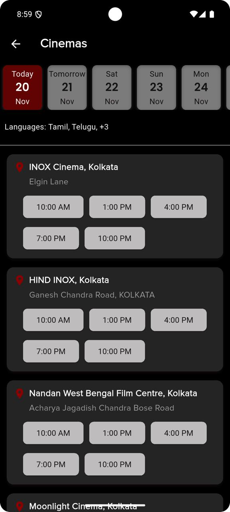

### 8. Seat Map & Screen Preview Modal
The Seat Map Screen shows the selected Movie, Showtime and Theatre. It allows user to select the desired seats. 

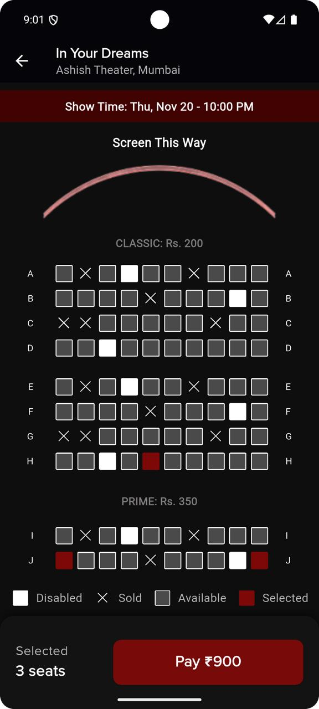

When selecting a seat, a seat preview modal shows a realistic 2D visualization of the screen from the chosen position. This feature helps users understand the viewing angle, screen visibility, and seating comfort, reducing the chances of dissatisfaction during the movie.

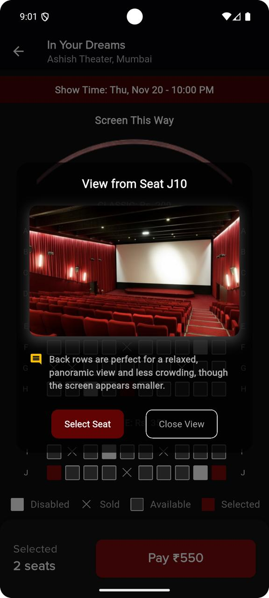

### 9. Ticket Confirmation
After successfully booking a ticket, users receive a confirmation screen detailing their seat, showtime, and theatre.

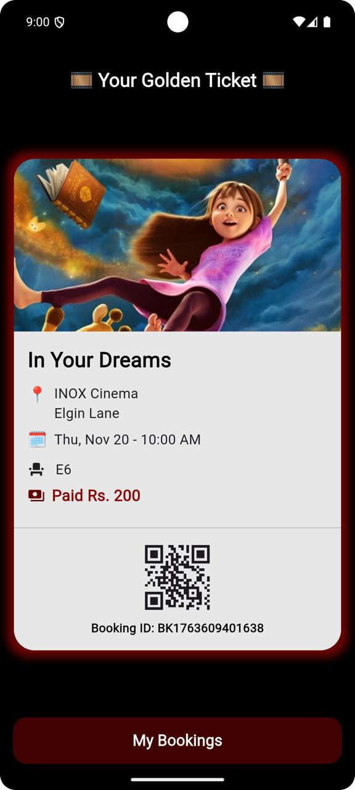

### 10. My Bookings
All booked tickets are saved in the “My Bookings” section for easy access, allowing users to view their history and submit post-movie reviews once the showtime has passed.

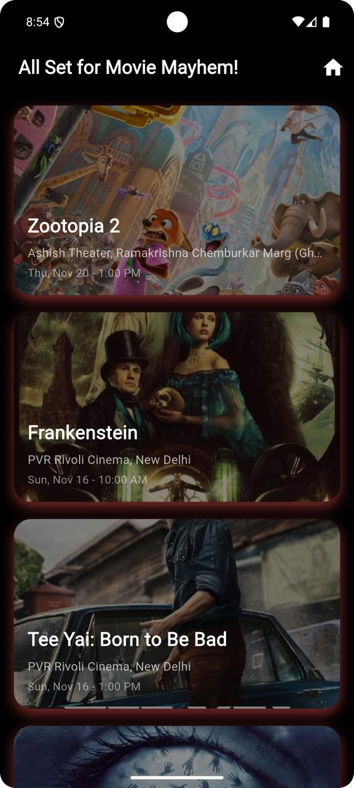

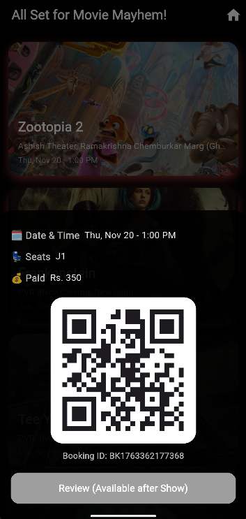

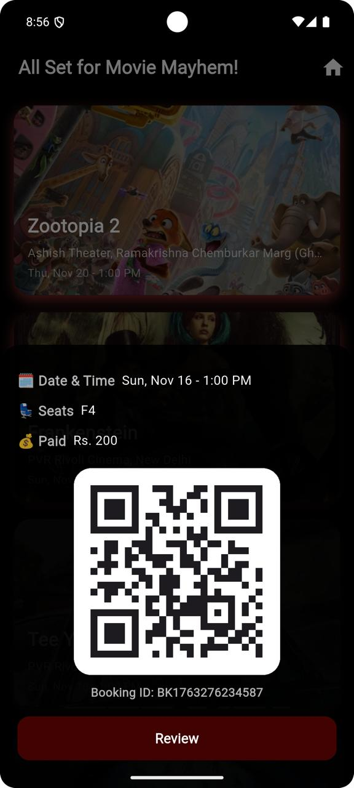

### 11. Review Page
Once the "Review" button is enabled, clicking it directs the user to the review page. This page features 10 thoughtfully designed questions that capture the user’s sentiments effectively. Submitted reviews can be viewed and updated later in the "My Bookings" section.

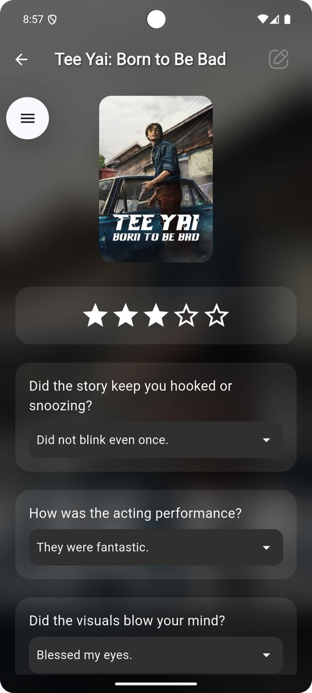

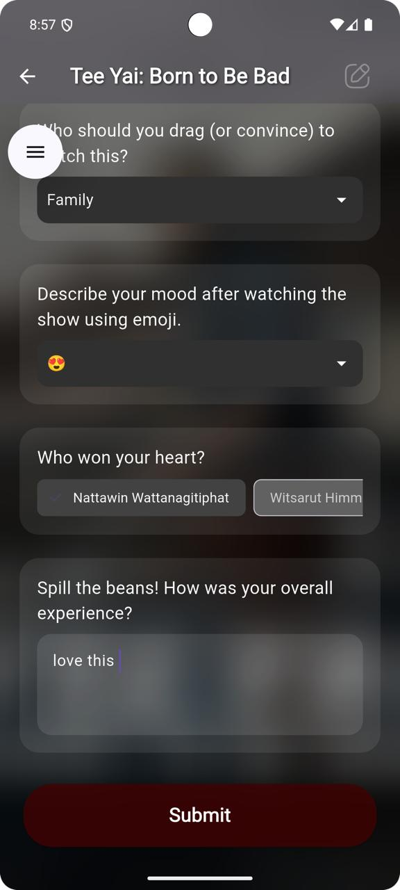

### 12. Rewards & Credits
Users earn credits for submitting verified reviews, which contribute to their total reward balance. Accumulated credits can be redeemed as dummy wallet money within the app, incentivizing continued engagement and creating a rewarding cycle for active participation.

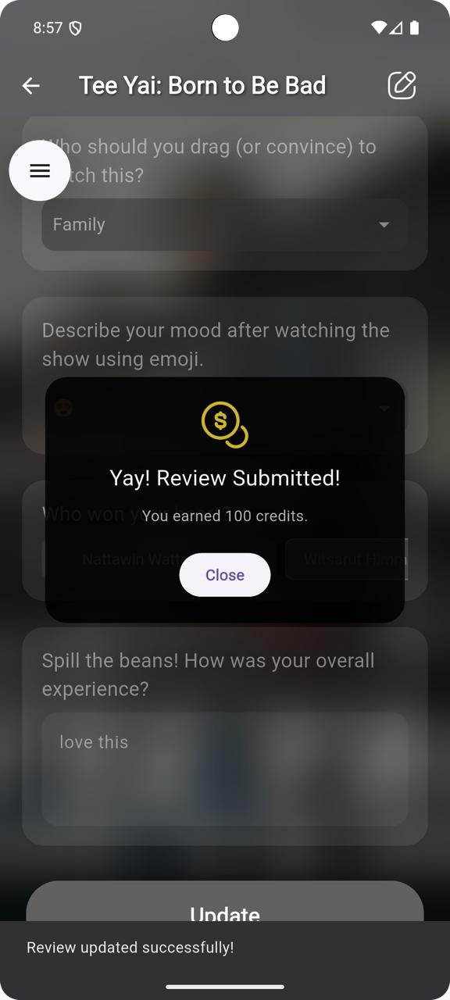

---

## 🚀 Future Scope

The platform has significant potential for expansion and improvement.

- Advanced seat visualization, including 360-degree views and AR-based simulations, can make the booking experience more immersive.

- AI-driven personalization could recommend movies, suggest optimal seats, and predict peak booking times.

- The verified review ecosystem can be enhanced with critic reviews, sentiment analysis, and spoiler-free summaries.

- Gamification elements such as badges, referral rewards, and watch streaks can increase user engagement and retention.

- Cross-platform availability, location-based services, and regional expansion will broaden accessibility and grow the user base.

- Integration of a payment gateway to provide a seamless and secure payment experience.

---

## 📚 References

- [Flutter Documentation](https://flutter.dev)  
- [TMDb API Documentation](https://developer.themoviedb.org/docs/getting-started)  
- [OpenStreetMaps Overpass API and Python](https://pybit.es/articles/openstreetmaps-overpass-api-and-python/)  
- [SeatGeek]( https://seatgeek.com/venues/comerica-park/views/section-213)

- [A View From My Seat](https://aviewfrommyseat.com/venue/M-and-T+Bank+Stadium/142/.)

- [Co-op Live’s Interactive Seat Map](https://www.cooplive.com/co-op-live-s-interactive-seat-map-hdbz)

---

### ⭐ Conclusion

**Book It Now** is more than a simple ticketing application. It is a **community-focused, reward-driven, and intelligent movie booking platform** that enhances movie discovery, user engagement, and the overall viewing experience. By integrating verified reviews, seat previews, and incentive-based participation, the application sets a new standard for mobile movie-ticketing solutions.
